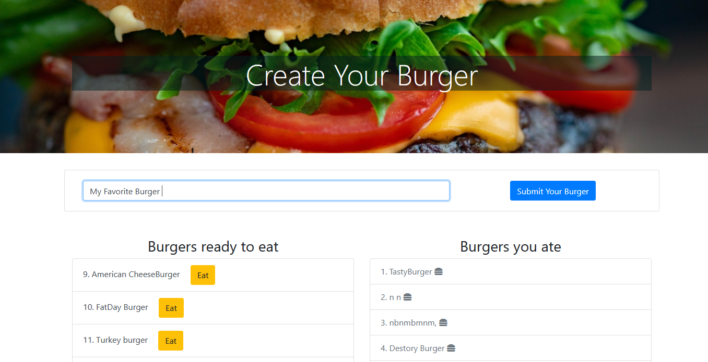
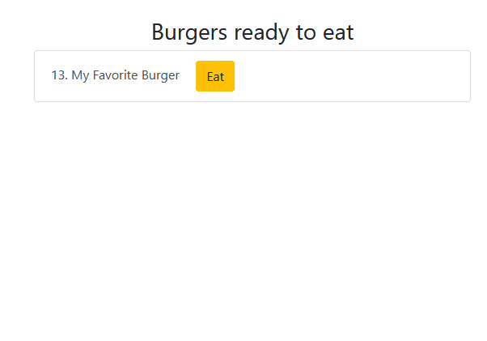
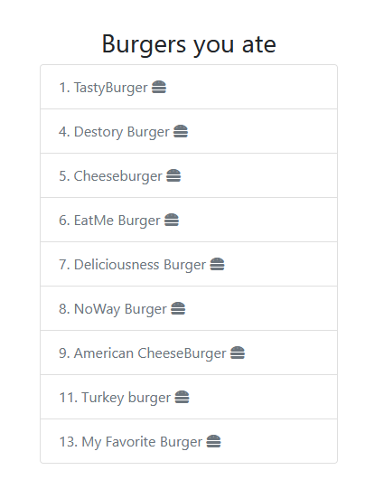

# Burger Logger with ORM 

### Purpose 

To demostrate my ability to build my first full stack application using the MVC design pattern. Where users can interact with a user interface and the data will be saved to a MySQL database. 

### Functionality

This is a burger logger that allows a user to create their own custom burger names. Built with MySQL, Node, Express, Handlebars and ORM technique - using a MVC design pattern. 

[Deployed Link](https://sparky-burgers.herokuapp.com) 

## App Demo 

### User Input - click submit 

### Added Burger to List - click eat 

### Eaten Burgers 

### Technologies Used 

- JavaScript
- OpenWeather API
- HTML
- CSS
